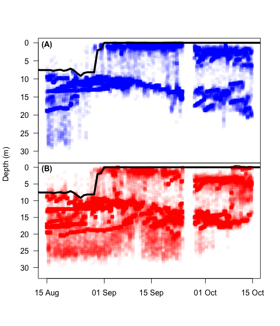
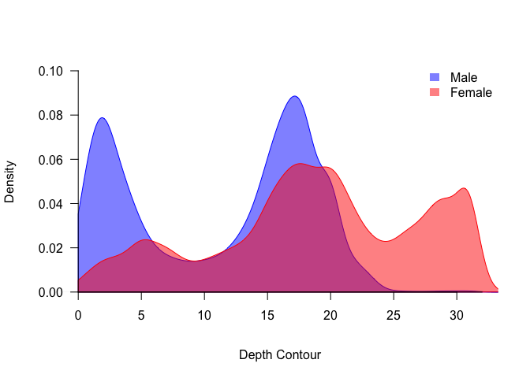
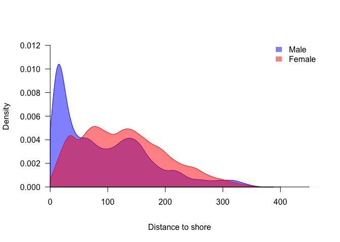
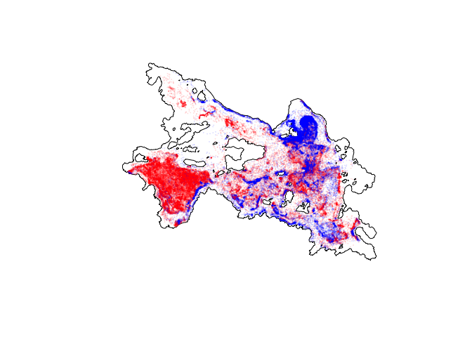
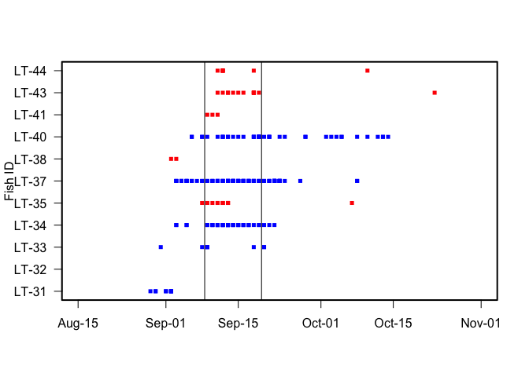
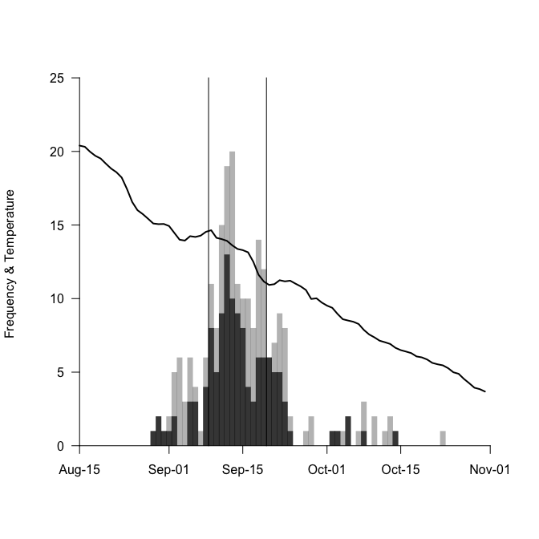
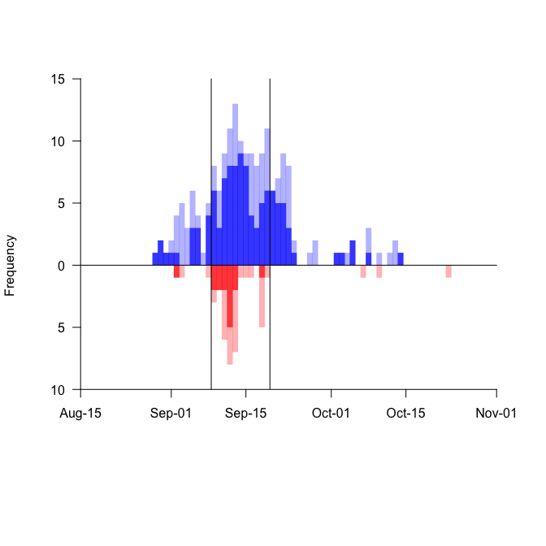

Title: Lake trout (*Savelinus namaycush*) reproductive behaviour in a northern lake

Authors: David Thomas Callaghan1\*, Paul James Blanchfield1,2, Matt M. Guzzo1, and Peter A. Cott3

1Department of Biological Sciences, University of Manitoba, 50 Sifton Road, Winnipeg, MB R3T 2N2, Canada 2 Freshwater Institute, Fisheries and Oceans Canada, 501 University Crescent, Winnipeg, MB, R3T 2N6, Canada 3 Cumulative Impact Monitoring Program - Environment and Natural Resources, Government of the Northwest Territories, Box 1320, Yellowknife, Northwest Territories X1A 2L9, Canada.

\*Corresponding Author Email: <callagdt@myumanitoba.ca>

Abstract
--------

This thesis investigates lake trout (*Salvelinus namaycush*) reproduction northern lakes. Lake trout have a broad distribution across Canada's North, yet most studies that describe reproductive habitat are from the southern extent of their range. I first assessed whether lake trout spawning habitat, typically characterized as wave-swept shoals with clean cobble that face predominant wind directions, is similar for a northern lake. Specifically, I examined a dozen sites around Alexie Lake, Northwest Territories, to test if physical habitat and wind exposure were important determinants of spawning site use and embryonic survival. Spawning occurred in ~2 m water depth, on 3–15 cm diameter clean substrate found on the leading edge of shoals that ended in a rock crib rising abruptly in nearshore regions around the lake. Wind direction was predominantly from the west, although it was highly variable within and among spawning seasons. I found evidence of lake trout spawning at each site examined, but not limited to shoals facing a predominate wind direction. High variation in embryonic survival (2–83%) from incubation trays was observed among spawning sites, suggesting a large gradient in habitat quality exists within a given lake. Modelled wind exposure did not predict embryonic survival, nor did physical characteristics that may influence interstitial water flow on spawning shoals. I also provide a detailed description of the lake trout mating system at the whole lake scale in a typical northern boreal lake. Using an acoustic telemetry monitoring system and a novel spatial temporal clustering analysis, I was able to quantify lake trout spawning movements and behaviours over the course of an entire spawning season. Lake trout were found to cluster on spawning shoals virtually around the entire nearshore region of Alexie Lake, as well as around several islands, which appears to further confirm previous findings that subtable spawning habitat is abundant in Alexie Lake. Males arrived earlier than females and spent longer durations on spawning shoals over the course of the spawning season. Males formed \>4 times as many spawing clusters and visited more sites than females. Spawning clusters predominantly were formed at night but were also observed during daylight hours, especially during the peak spawning season. I found males may exert more energy than females during the spawning season, with males showing higher activity rates and longer periods spent on spawning shoals than females, in spite of similar daily travel distances between sexes. Overall, females performed more linear movements over the course of the spawning season suggesting a searching behaviour, while males were less persitent and more random in there movements. Our findings challenge the conventional role of wind as a predominant predictor of lake trout spawning site quality. We propose that the unpredictable nature of wind and abundance of suitable habitat may favour lake-wide spawning by lake trout as a bet-hedging strategy in northern lakes with limited fetch.

Introduction
------------

The evolution of animal mating systems is mainly influenced by sexual selection [@andersson\_sexual\_1994], parental care [@trivers\_parental\_1972] and the spatial temporal distribution of resources and mates [@emlen\_ecology\_1977]. In many species, males optimize their fitness by mating with multiple females. By contrast, the optimal mating rate of females is limited by the production of progeny per mating event [@bateman\_intra\_1948]. This high energetic investment in gametes by females relative to males often results in conventional sex roles, whereby females provide parental care and males compete for access to females [@kokko\_parental\_2008]. Because parental care is uncommon in fishes [only found in 21% of families; @blumer\_bibliography\_1982], their mating systems are ultimately shaped by the distribution of resources necessary for each sex to ensure successful reproduction [@emlen\_ecology\_1977].

Salmonine fishes (salmons, trouts and chars) are typically observed in a site-based competitive mating system where males compete for access to females, which is thought to be the limiting resource [@gross\_sunfish\_1984], while females compete for territories to establish and prepare their spawning sites [@fleming\_pattern\_1998]. Females construct a nest (a series of pits termed a redd) and deposit eggs that are fertilized externally by one or more males. Limited numbers of suitable spawning sites and variability in spawning site quality results in females becoming very selective when choosing their nest sites [@blanchfield\_relative\_2005; @esteve\_observations\_2005; @degaudemar\_sexual\_1998]. Males will fight for proximity to females, with body size and exagerated body shape being the main factors in establishing dominance hierarchies [@fleming\_breeding\_1994; @quinn\_effects\_1994]. Paternity tests have shown that the closest male to the female generally fertilizes the greatest proportion of eggs [@blanchfield\_breeding\_2003; @mjolnerod\_mate\_1998], thus proximity to females increases fertilization success. As a result, male reproductive success is maximized quantitatively, by mating with as many females as possible; whereas female reproductive success is maximized qualitatively, by choosing high quality nest sites and males [@degaudemar\_sexual\_1998].

The reproductive behaviours of lake trout (*Salvelinus namaycush*) sharply contrasts the typical salmonine mating system described above [@gunn\_spawning\_1995; @esteve\_lake\_2008; @muir\_lake\_2012]. Spawning usually takes place in lakes on waveswept shoals, and unlike all other salmonines, lake trout do not provide any parental care [i.e., no redd is constructed by the female; @martin\_lake\_1980]. Eggs are spawned directly onto clean substrate, where they fall into interstitial spaces and incubate for several months before emerging [@royce\_breeding\_1951]. Lake trout also do not displayovert male-male agonistic behaviour [@royce\_breeding\_1951; @gunn\_spawning\_1995; @esteve\_lake\_2008], a predominant behavioural characteristic of the Salmoninae subfamily [@esteve\_observations\_2005]. Further, females do not show territorial behaviour (i.e. redd defence) or obvious mate selection [@esteve\_lake\_2008]. However, some similarities do occur in mating behaviour between lake trout and other salmonines, including males arriving earlier on breeding grounds and staying longer than females each year [@miller\_observations\_1948; @royce\_breeding\_1951; @martin\_lake\_1980; @muir\_lake\_2012]. In the absence of a site-based competitive mating system and parental care, mating system theory predicts that female reproductive success is driven by habitat quality and mate selection, whereas male reproductive success should be driven by spawning frequency [@degaudemar\_sexual\_1998].

Lake trout (*Salvelinus namaycush*) are a long lived, iteroparous species that typically spawn in lakes during the fall [@gunn\_spawning\_1995]. Migration from the offshore summer refuge onto nearshore spawning shoals generally coincides with surface water temperatures declining to 12° C or lower [@redick\_review\_1967]. Preferred spawning habitat is selected along exposed shorelines off points, islands or on mid-lake shoals containing clean substrate including pebble and cobble mainly 3-15 cm in diameter [@martin\_lake\_1980; See Chapter 2]. Spawning predominately occurs during night time [@gunn\_spawning\_1995] but has been observed during the day [@esteve\_lake\_2008; @muir\_lake\_2012; @binder\_new\_2015]. Males often constitute 60–85% of annual spawning populations,,, resulting in highly skewed sex ratios on spawning shoals. This imbalance is thought to be a product of earlier maturation, early arrival and longer duration on spawning grounds and the increased likelihood of males spawning each year [@miller\_observations\_1948; @eschmeyer\_reproduction\_1955; @martin\_reproduction\_1957].

Lake trout reproductive behaviour is relatively understudied when compared to other salmonines, and what literature exists is largely from the southern extent of it's geographic range [@muir\_lake\_2012]. In general, information on the timing of movement onto spawning shoals and the degree of movements among spawning sites for males and females at seasonal and daily scales remains an important knowledge gap. Furthermore, few studies have investigated reproductive strategies of lake trout [@esteve\_lake\_2008; @muir\_lake\_2012].

The objectives of this chapter is three-fold: (i) to determine when and where lake trout spawn in a typical northern boreal lake; (ii) to describe sex-specific timing and movements of lake trout over the duration of a spawning season; and (iii) to test whether male and female lake trout employ a bet-hedging strategy by spawning on multiple sites. Using data collected from a whole-lake acoustic telemetry array, I will present the movements of five male and six female lake trout over the course of the 2013 spawning season. A spatial temporal clustering analysis was used to determine when and where lake trout formed spawning clusters. These data reveal new insights into the reproductive strategies of male and female lake trout and further our knowledge on spawning site use for managing this iconic Canadian fish species.

Methods
-------

### Study Site

The study was conducted in Alexie Lake (62° 40' N, 114° 05' W), located approximately 30 km northeast of Yellowknife, Northwest Territories, Canada (Fig. 3.1). Alexie Lake is a medium size (area: 402 ha, maximum depth: 32 m, mean depth: 11.7 m) oligotrophic lake, possessing 35 islands and a shorelength of 28 km. Stratifcation occurs during the summer until September when the lake becomes isothermal [@healey\_experimental\_1973; @cott\_diel\_2015]. Alexie Lake contains four large bodied species; lake trout, northern pike (*Esox lucius*), lake whitefish (*Coregonus clupeaformis*) and burbot (*Lota lota*) as well as numerous prey species [see @cott\_food\_2011]. Alexie Lake is a designated research lake that is closed to fishing.

<!---->
### Lake water temperature

Water temperature in Alexie Lake was recorded hourly on HOBO® Pendant™ temperature loggers (Onset® Computer Corporation, Borne, MA) set in the deepest basin at 0.5 m, at 1 m depth intervals from 1 m to 20 m and at 25 m and 30 m below the water surface. Mean daily temperature for each depth was calculated followed by a spline interpolation to obtain temperatures for every 0.1 m depth interval from lake surface to bottom. Interpolated daily temperature profiles were used to estimate water temperatures occupied by lake trout impanted with pressure-sensing telemetry transmitters [see@guzzo\_resource\_; @plumb\_performance\_2009], and determine the role of water temperature in the annual timing of spawning

### Lake bathymetry

A high-resolution hydroacoustic survey was conducted in June 2012 (Milne Technologies, Keene,ON, Canada) producing a detailed bathymetric raster (2.5 x 2.5 m). Hydroacoustic data were collected using a 120 kHz Simrad EK60 7.0° split-beam echo sounder system following a systematic parallel survey design with transects 25 m apart [for details see @cott\_diel\_2015]. These data were used to determine the bathymetric depth for each lake trout telemetry position (see below). This in conjunction with the pressure sensor reading (see below) allows the determination of fish depth from the lake bottom.

### Fish acoustic telemetry

Five male (fork length range: 478--525 mm, weight range: 1193--1535 g) and six female lake trout (fork length range: 466--557 mm, weight range: 1067--1840 g) were studied during the 2013 spawning season (approximately the month of September). All lake trout were captured by angling with a barbless lure in the spring (June 12--13, 2013) when surface water temperature was \<15° C. Once captured lake trout were brought to shore in holding containers, lightly anesthetized in a solution of 90 mg L-1 Tricaine Methanesulfonate buffered with sodium bicarbonate and surgically implanted with a coded acoustic transmitter with pressure (for depth) and accelerometer (for activity) sensors that that randomly emitted an acoustic signal every 80--160 s (V13AP-1L, tail beat algorithm; VEMCO, Ltd., Bedford, NS. Canada). See Blanchfield et al. [-@blanchfield\_relative\_2005] for details on surgical procedures. Transmitters were 13 mm in diameter, 44 mm in length, and weighed 6 g in water. Each transmitter's depth sensor was individually calibrated at 4 m depth intervals from the surface to lake bottom in Alexie Lake, and were accurate to ± 1.7 m.

The spatial positions of lake trout implanted with acoustic transmitters were monitored using a VEMCO Positioning System (VPS; VEMCO Ltd.) --- an fine-scale positioning system used for tracking aquatic animals. The VPS uses hyperbolic positioning, also known as multilateration, which measures the time difference on arrival (TDOA) of a signal from a transmitter at three or more time-synchronized receivers [@smith\_understanding\_2013]. An array of 72 underwater omni-directional acoustic receivers (VEMCO, VR2W) with a mean distance of 201.4 m (range: 120.4m--311.9m) between receivers, was deployed in Alexie Lake to monitor lake trout during spawning behaviour 2013 (see Appendix for further details).

### Acoustic telemetry data filter

Prior to analyses telemetry positions were filtered to ensure that only the highest quality data were used to examine lake trout spawning behaviour. First, positions with successive timestamps less than the minimum interval (80 s) for each individual fish were removed as these positions were assumed to be false positions. Second, lake trout positions greater than 2.5 m (size of one raster grid) outside of the lakeshore were removed. The additional 2.5 m buffer outside of the lakeshore was applied because lake trout are known to spawn in the nearshore area of Alexie Lake (see Chapter 2) which is also a region of increased telemetry error (see Appendix), thus the additional buffur retains valuable spawning data. Third, lake trout depth data had to be greater than or within 2 m of the lake bottom to encompass pressure sensor error (±1.7 m). Fourth, only successive positions less than realistic lake trout swimming speeds [\<1.2 m s^-1^; @font\_behavioural\_2015] were included. Finally, I conducted stationary tag trials using VEMCO V13-1P tags with random signal transmission between 10 s to 30 s on known nearshore spawning shoals. I calculated the twice the distance root mean squared (2DRMS) for each estimated stationary tag position, relative to their known location in order to develop a relationship between measured error and hyperbolic positioning error (HPE), a unitless estimate of positioning error provided for each spatial position estimated by the VPS (See Appendix for further details). Using the relationship between 2DRMS and HPE for stationary tag data, I determined that removing all data with an HPE \>106 would result in 95% confidence that our data has measurment error less than 27 m, which was determined to be sufficient for our cluster analyses (see Appendix). After filtering, 87% of the original dataset was retained.

### Movement metrics

The spawning season was defined as the period between August 30 (day after the 15° C isocline broke; see below)-- September 30 (estimated end date; but see below). Using movement data collected during the spawning season, I calculated for each day, the (1) mean distance travelled (m), (2) mean acceleration (m s-2) for energy expenditure or activity of males and females and (3) daily persistence index (PI) or mean cosine of turning angles (unitless) to determine the linearity of movements. The PI ranges from -1 to 1, where a PI = 1 corresponds to linear or directed movement, PI = 0 corresponds to uncorrelated and therefore more tortuous movement, and PI = -1 corresponds to movements that oscillate back and forth [ @laidre\_females\_2012].

### Spatial temporal clustering analysis

Spatial temporal cluster analysis was performed using the density-based clustering algorithm, Spatial Temporal Density-Based Spatial Clustering of Applications with Noise [ST-DBSCAN; @birant\_st\_2007] to determine areas in Alexie Lake where individual lake trout remained for significant periods of time during the spawning season (i.e. during spawning behaviour, feeding behaviour, resting, etc.). The spatial temporal clustering algorithm requires data points with three required fields: x coordinate, y coordinate and timestamp. Additionally four parameters are required to create clusters: epsilon distance---the Euclidean distance parameter for spatial attributes; epsilon time---the Euclidean distance parameter for time attributes; minimum points-–-the minimum number of points required to create a cluster; and \(\Delta\)\(\epsilon\)-–-the acceptable change in time between the current cluster mean and the potential new addition to the cluster. Model parameters were estimated using a simple heuristic described by Ester et al. [-@ester\_density\_1996] and Birant and Kut [-@birant\_st\_2007] with my data (See Appendix for further details on parameter estimation). Parameters estimates were as follows: epsilon distance = 41 m; epsilon time = 3254 s; minimum points = 9; and \(\Delta\)\(\epsilon\) = 2 SD. Details on the refinement of these data to determine whether clusters represent spawning activity are described below.

### Spawning activity determined by cluster filtering

The spatial temporal clustering algorithm is non-biased towards the behaviour of the fish during the cluster formation. This means that when individual fish cluster, it could represent a number of different behaviours, such as spawning, feeding or resting. Therefore, filtering was required to identify potential spawning clusters. Because lake trout spawn nearshore at shallow depths (~2 m) during the month of September in Alexie Lake (see Chapter 2; personal observation), I used distance to shore and depth contour occupied as a filter for identifying potential spawning clusters. This was done as follows. I plotted kernel density estimates (KDE) of distance to nearest shore occupied by male and female lake trout (see Fig. 3.4) which indicated that males remain closer to the shore during the spawning season. It is well documented that males come onto the spawning shoals first and remain longer than females [@miller\_observations\_1948; @royce\_breeding\_1951; @martin\_lake\_1980; @muir\_lake\_2012], so I selected a 50 m distance to shore criteria based on the visual inspection of the male distance to nearest shore KDE. I also plotted the KDE of contour depth occupied by male and female lake trout (see Fig. 3.3) and found a bimodal distribution for males. The shallower depth contour KDE mode is likely potential spawning males on spawning shoals and therefore I included a criteria of \<4 m depth contour. In order to be considered a potential spawning cluster, \>50% of the detections within a given cluster must have met both criteria (distance to shore \<50 m and depth contour \<4m).

Sites where potential spawning clusters formed were considered spatially unique when the cluster centers were \>70 m apart. This spatial criteria was based on mean distance between the center of known spawning shoals along a 780 m stretch of an Alexie Lake shoreline (site 1; see Chapter 2). Male lake trout often aggregate on spawning shoals but show very little behavioural activity other than when slowly swimming along the spawning shoals edge, however; when one or more females approach a male aggregation, a frenzy of activity ensues [personal observation; esteve\_lake\_2008; @muir\_lake\_2012; @binder\_new\_2015]. To distinguish between these low and high activity periods on spawning shoals, I categorized spawning clusters as low or high activity clusters based on whether the maximum acceleration recorded during a specific cluster was greater or less than 1.3 m s-2. This criteria was determined from the mean acceleration of all clusters (spawning and non-spawning; *n* = 4622) + 2 standard deviations (SD).

### Spawning cluster metrics

Spawning clusters were used to determine the timing of lake trout spawning, where the onset and conclusion of the spawning season were defined as the earliest and latest occurrence of a spawning cluster, respectively. Peak spawning was determined as the earliest and latest date where the daily number of spawning clusters was equal to at least half the maximum number of spawning clusters recorded in a day. To determine if lake trout were spawning in during the day or night, I used the *crepuscule* function from the maptools R package [@maptools\_2015] to define periods of day, night, dawn and dusk for Alexie Lake, NWT, during the spawning season. Spawning cluster metrics were calculated for each individual fish and summarized into mean and standard deviation for: (1) frequency of spawning cluster formation, (2) total cumulative duration spent in spawning clusters, (3) duration per cluster formation, (4) total spatially unique sites visited, (5) the distance and (6) duration between subsequent spawning clusters, (7) frequency of cluster formations with low activity (site visits) prior to first high activity cluster (spawn event). Minimum convex polygons (MCP) were calculated using the *mcp* function from the adehabitatHR R package [@adehabitat\_2006], to determine the spatial spread of lake trout spawning clusters.

### Statistical analysis

All analysis were completed in R V.3.2.1 [@R\_2015]. Kernel density estimates (KDE) were computed for distance to shore, depth contour occupied, and depth occupied by lake trout using the *density* function in R. The resulting KDE's were multi-modal, therefore mode means of the KDE's were determined using the *normalmixEM* function, a Expectation-Maximization (EM) algorithm for mixtures of normal distributions, from the *mixtools* R package [@mixtools\_2009]. Mean times and standard deviations of all and high activity spawning clusters were calculated with the *circadian.mean* and *circadian.sd* functions from the *psych* R package [@psych\_2015] which calculates the circular mean of circadian data. Using spawning cluster formation start times for all spawning clusters and high activity spawning clusters, I tested whether lake trout spawn during the night or day using a Pearson's Chi-squared test. Using the *loess* function in R, I applied a LOESS (local polynomial regression) curve fitting smoother to the frequency of lake trout spawning by binned one hour segements for all spawning clusters (both high and low activity) and high activity spawning clusers to show the general spawning time trends. A non-parametric Wilcoxon rank sum test was used to test differences in, daily displacement PI, acceleration and site visits prior to spawning between sexes. A log transformation was applied to cluster formation frequency, total duration, mean duration, site visits, distance and duration between consequtive clusters, and minimum convex polygon area data to meet parametric assumptions prior to testing diffferences between sexes, activity state (high or low) and the interaction of sex and activity state using a type III two-way ANOVA.

Results
-------

### Spatial distribution of lake trout

The migration of both male and female lake trout from the deeper offshore to shallower nearshore regions of Alexie Lake corresponded to the breakdown of the 15°C isocline (August 29, 2013; Fig. 2). A clear bimodal depth distribution was apparent for both males and females during the spawning season, with males distributed around mean depths of 1 m and 12 m and females distributed around mean depths 2 m and 14 m. Telemetry-tagged male lake trout occupied areas of Alexie Lake where mean lake depths were 3 m and 17 m while females occupied mean lake depths of 5 m, 18 m, and 29 m (Fig. 3).

**Fig. 2:** Depth distribution of males (A) and females (B) during the spawning season in Alexie Lake, NWT. The black line represents the 15° C isocline. Points were given transparency value of 5%, therefore the darker the colour the higher the density of points. No data is available between September 25-27, 2013, while the VPS was removed from the lake for download

**Fig. 3:** Kernel density estimate of bottom contour depth occupied by male (blue) and female (red) lake trout in Alexie Lake, NWT, between August 30 and September 30, 2013.

The spatial distribution of lake trout in Alexie Lake differed between sexes during the spawning season. Males had a higher density of detections in the nearshore region than females (Fig. 4 and 5). Males exhibited a clear peaked mode at a mean distance from shore of 14 m, and a second distinct mode at a mean distance from shore of 131 m (Fig. 4). Female lake trout exhibited three major modes at mean distances from shore of 28 m, 72 m, and 127 m, but none showed the same high density as males (Fig. 4).

**Fig. 4:** Kernel density estimate (KDE) of distance to nearest shore occupied by male (blue) and female (red) lake trout in Alexie Lake, NWT, between August 30 and September 30, 2013.

**Fig. 5:** Male (blue), and female (red) lake trout positions during the 2013 spawning season in Alexie Lake, NWT. Points were given transparency value of 10%, therefore the darker the colour the higher the density of points

    ## Warning: package 'deldir' was built under R version 3.2.4

    ## Warning: package 'ade4' was built under R version 3.2.4

    ## Warning: package 'adehabitatMA' was built under R version 3.2.5

    ## Warning: package 'adehabitatLT' was built under R version 3.2.5

### Spatial distribution of spawning clusters

A total of 226 lake trout spawning clusters were estimated using the spawning cluster analysis, of which 124 (55%) were classified as high activity clusters and more likely to have spawning behaviour taken place (Fig. 6). Spawning clusters were found throughout the nearshore region of Alexie Lake, covering an area of 4.26 km2 (based on MCP).

**Fig. 6:** Lake trout spawning clusters in Alexie Lake, NWT during the 2013 spawning season. The smaller red circles represent the center of high activity clusters and larger blue circles represent the center of low activity clusters

### 3.3.3 Timing of spawning

All five males formed spawning clusters, while five out six females investigated formed spawning clusters; LT-32 never formed a spawning cluster in 2013 and was designated a non-spawning female (see Fig. 7). Lake trout showed a wide range in timing of spawning cluster formation, with males spending 4--25 days on spawning shoals compared to only 2--9 days by females. Most individuals (80%) were present during peak spawning, but two individuals, LT-31 (male) and LT-38 (female) only formed spawning clusters early in the season prior to peak spawn and did not return during or post peak spawn.

**Fig. 7:** Spawning cluster formation by individual lake trout in Alexie Lake, NWT. Squares represent one or more spawning cluster formed on the date for males (blue) and females (red) and vertical black lines represent the onset and conclusion of peak spawning.

Based on spawning clusters, the onset of lake trout spawning in 2013 began August 29 coinciding with a surface temperature of 15.1°C (Fig. 8). Spawning occurred over a 55 d period and concluded on October 23 when surface temperature was 5.5°C. Peak spawn began on September 9, and lasted 10 d, concluding on September 19. Surface temperature was 14.6°C at the start of peak spawn and dropped 3.5°C over the duration of peak spawn. The maximum number of spawning clusters (20) occured on September 13. The majority of all spawning clusters (61%) and high activity spawning clusters (65%) occurred during peak spawn. The frequency distributions of total, high activity, and low activity spawning cluster were similar (Fig. 8). Peak spawning for male and female lake trout occurred at similar dates, with peaks occurring on September 13 and September 12, respectively (Fig. 9). Males collectively remained on the spawning shoals for maximum of 25 consecutive days while females collectively spent a maximum of 8 consecutive days.

**Fig. 8:** Frequency distribution of spawning clusters over the duration of the 2013 spawning season in Alexie Lake, NWT. Light grey bars represent the cumulative frequency of spawning clusters (both low and high activity), dark grey bars represent high activity spawning clusters, the horizontal black line represents daily surface water temperature (°C) and the vertical black lines represent the onset and conclusion of peak spawning.

**Fig. 9:** Frequency distributions of male (blue) and female (red) spawning clusters over the duration of the 2013 spawning season in Alexie Lake, NWT. Light bars represent daily cumulative frequency of spawning clusters (both low and high activity), dark bars represent high activity spawning clusters and vertical black lines represent the onset and conclusion of peak spawning.

    ## Warning: package 'lubridate' was built under R version 3.2.5

    ## Warning: package 'psych' was built under R version 3.2.5

Lake trout showed a significant preference for spawning during the night; 65% of high activity spawning clusters occured at night (Pearson's Chi-squared Test: *X2* = 10.45; *p* = 0.001). However, when considering all spawning clusters (both high and low activity clusters), lake trout did not show a significant preference for night spawning (Fig. 3.10). Mean cluster formation occurred at 22:42 ± 1.9 h (mean ± SD), and high activity spawning clusters occurred at 22:21 ± 1.5 h. The maximum number of spawning clusters (*n* = 19) occurred between 19:00--20:00, similar to the greatest number of high activity spawning clusters (*n* = 13), which also occured between 19:00--20:00. The minimum number of spawning clusters (*n* = 0) occurred between morning hours of 24:00--25:00, and no high activity spawning occurred between the hours of 15:00--16:00, 24:00--25:00.

**Fig. 10:** Lake trout spawning cluster formation start times over the duration of the 2013 spawning season (left panel), and summarized as total counts per hour (right panel), in Alexie Lake, NWT. Both low activity (open circles) and high activity (closed circles) are displayed in both panels. Light grey polygons represent dawn and dusk, dark grey polygons represent night time and vertical black lines represent the onset and conclusion of peak spawning. The lines in the right panel represent a LOESS trendline with 95% confidence interval error bars.

### Lake trout spawning behaviour

Over the course of the spawning season lake trout daily distance travelled was not significantly different between spawning males and females with both sexes moving ~ 7 km per day (table 1). The non-spawning female did show a higher daily displace of 11.91 (±2.97; table 1). Spawning females made more linear movements than males, as indicated by females having a significantly higher persistence index (Wilcoxon Rank Sum Test: *W* = 6506; *p* \< 0.001; table 1). The non-spawning female also made more directed movement consisitent with spawning females but with a greater PI (0.23 ± 0.09; table 1). Spawning males exerted significantly more energy than females over the course of the spawning season in spite of similar daily displacements, exhibiting daily acceleration rates 0.12 m s-2 greater than females (*W*= 1.2048× 104; *p* \< 0.001; table 3.1). The non-spawning female also showed similer acceleration as spawning females (0.36 ± 0.08; table 1).

**Table 1:** Summary statistics for spawning male, spawning female and non-spawning female lake trout movement metrics during the 2013 spawning season in Alexie Lake, NWT. I report the number of fish (n), means and standard deviations of daily distance travelled (km), persistence index (PI), and acceleration (m s-2).

|         Sex         |  n  | Daily Distance (km) |      PI     | Acceleration (m s-2) |
|:-------------------:|:---:|:-------------------:|:-----------:|:-------------------------------:|
|    Spawning Male    |  5  |     7.02 (3.56)     | 0.07 (0.18) |           0.49 (0.28)           |
|   Spawning Female   |  5  |      7.5 (3.48)     | 0.17 (0.17) |           0.37 (0.18)           |
| Non-spawning Female |  1  |     11.91 (2.97)    | 0.23 (0.09) |           0.36 (0.08)           |

Telemetry-tagged male lake trout created a total of 185 clusters, 59% of which were high activity clusters. Females on the otherhand created only 41 clusters, 37% of which were high activity clusters. Male individuals formed significantly more clusters on average than females (ANOVA: *F*(1,16) = 8.52; *p* = 0.01; table 3.2). No significant difference was found between activity states (*p* = 0.72) or the interaction of sex and activity (*p* = 0.376).

Cluster duration differed significantly between activity states with lake trout spending 61.67 more minutes in high activty cluster than low activity clusters (*F*(1,222) = 4.27 ;*p* = 0.04). No significant differences in cluster duration were found between sexes (*p* = 0.97) or the interaction of sex and activity (*p* = 0.19), even though males spent on average 43.8 minutes longer in clusters than females (table 3.2). Males in total spent significantly more time in spawning clusters (1.4 ± 1.3 days) compared to females (0.5 ± 0.6 days; *F*(1,16) = 7.79 ; *p* = 0.01). No significant differences in total cluster duration were found between activity state (*p* = 0.4) or the interaction of sex and activity (*p* = 0.37). Males visited significantly more spatialy unique spawning sites, visiting 5 more unique sites on average than females (*F*(1,16) = 6.68; *p* = 0.02). No significant differences in number of site visits were found between activity state (*p* = 0.9) or the interaction of sex and activity (*p* = 0.42).

Although the distance between consecutive spawning clusters for females was 197.86 m greater than males (table 3.2), it did not significantly differ between sexes, activity state or the interaction of sex and spawning state. Similarly, despite the duration between female spawning clusters taking on average 52.9 more hours than males, no significant difference was found for duration between consecutive clusters between sexes, activity state or the interaction of sex and activity state. Low activity site visits prior to spawning (high activity site visits) were not found to be significantly different between males and females, each visiting roughly 2 sites prior to spawning (table 3.2). Male spawning site MCP area was on average 0.6 km2 greater than females (table 3.2), but was not found to be significantly different between sexes, activity state or the interaction between sex and activity state.

**Table 2:** Summary statistics for male and female lake trout spawning cluster data during the 2013 spawning season in Alexie Lake, NWT. For all male and female clusters (both high and low activity clusters) and spawning male and female clusters (high activity clusters), I report the number of fish (n), means and standard deviations of clusters formed, cluster duration, unique cluster sites visited, distance between consecutive clusters (m), duration between subsequent clusters (hr), site visits prior to first spawn and minimum convex polygon area of all cluster points (km2).

|          Sex         |  n  |  Clusters | Duration (min) |   Sites   | Distance Between Clusters (m) | Duration Between Clusters (hr) | Site Visits Prior to Spawn | MCP Area (km2) |
|:--------------------:|:---:|:---------:|:--------------:|:---------:|:-----------------------------:|:------------------------------:|:--------------------------:|:-------------------------:|
|       All Male       |  5  | 37 (31.9) |  168.5 (55.2)  | 9.2 (6.3) |        216.15 (316.64)        |          15.5 (316.6)          |              -             |          1 (0.9)          |
|   Low Activity Male  |  5  | 15.2 (15) |  123.1 (61.9)  | 5.8 (4.1) |         235.6 (314.23)        |           29 (314.2)           |              -             |         0.4 (0.5)         |
|  High Activity Male  |  5  | 21.8 (17) |  191.7 (54.9)  | 7.4 (4.5) |         257.18 (392.4)        |           22.2 (41.4)          |          1.8 (2.7)         |         0.9 (0.9)         |
|      All Female      |  5  | 8.2 (6.1) |  124.7 (46.5)  | 4.2 (2.5) |        414.01 (442.07)        |          68.4 (442.1)          |              -             |         0.4 (0.4)         |
|  Low Activity Female |  5  | 5.2 (5.4) |  104.2 (51.3)  | 3.2 (2.9) |         433.5 (461.94)        |          106.5 (461.9)         |              -             |         0.2 (0.3)         |
| High Activity Female |  5  |  3 (2.3)  |  131.1 (51.7)  |   2 (1)   |        348.08 (379.24)        |           13.7 (12.4)          |          2.4 (4.3)         |         0.1 (0.1)         |

Discussion
----------

I have provided a detailed description of the lake trout mating system at the whole lake scale in a typical northern boreal lake. Using an acoustic telemetry monitoring system and a novel spatial temporal clustering analysis, I was able to quantify lake trout spawning movements and behaviours over the course of an entire spawning season. Lake trout were found to cluster on spawning shoals virtually around the entire nearshore region of Alexie Lake, as well as around several islands, which appears to further confirm previous findings that subtable spawning habitat is abundant in Alexie Lake (Chapter 2). Consistent with other studies, males arrived earlier than females and spent longer durations on spawning shoals over the course of the spawning season [@miller\_observations\_1948; @royce\_breeding\_1951; @martin\_lake\_1980; @muir\_lake\_2012]. Males formed \>4 times as many spawing clusters and visited more sites than females. Spawning clusters predominantly were formed at night but were also observed during daylight hours, especially during the peak spawning season. Although daily travel distances were similar between sexes, higher activity rates and longer periods spent on spawning shoals by males suggests that males may exert more energy than females during the spawning season. Overall, females performed more linear movements over the course of the spawning season suggesting a searching behaviour, while males were less persitent and more random in there movements.

Suitable spawning habitat in Alexie Lake was found to be abundant and widespread (Chapter 2), so it was not surprising that spawning clusters were also found dispersed throughout the entire nearshore region of Alexie Lake. Individual lake trout utlized a wide range of spawning areas (0.01--1.9 km2), with males visiting more than twice as many sites. The area of spawning site use was not found to differ between males and females in spite of increased male spawning site visits. Further, no individual lake trout visited all spawning sites or formed spawning clusters over the full extent of the collective lake trout spawning area (4.2 km2), suggesting indidvidual lake trout only select subset of all possible spawning shoals over the duration of the spawning season. Whether this is a function of territories that individuals stay within [although no evidence has been found to date in other lake trout populations; @muir\_lake\_2012] or, more likely, the result of lake trout selecting spawning shoals with preferred environmental conditions [i.e. wind events; @martin\_lake\_1980; @muir\_lake\_2012] or mates [@binder\_new\_2015] is unknown and requires further investigation. In chapter 2, I found that high variability in wind direction within and across spawning seasons suggests wind, and the resulting wave induced currents, are not predictable during the lake trout spawning season. This unpredictability in wind and the abundance of suitable habitat may favour spawning across multiple sites by lake trout as part of a bet-hedging strategy [Chapter 2; @fitzsimons\_relationship\_2014]. Diversifying the spatial, physical, and chemical characteristics of spawning habitat, to increase the overall portfolio performance of reproductive success [@moore\_synchronization\_2010] may be a productive tactic to buffer the unpredictable nature of wind and weather conditions.

Consistent with other studies, males formed spawning clusters earlier than females and spent longer durations on spawning shoals over the course of the spawning season [@miller\_observations\_1948; @royce\_breeding\_1951; @martin\_lake\_1980; @muir\_lake\_2012]. Males formed four times as many spawing clusters and visited twice as many sites than females. These data support the hypothesis that males maximize reproductive fitness by spending as much time as possible on spawning shoals, thus maximizing possible mate encounters and fertilizations [@muir\_lake\_2012]. Another explanation for the early arrival of males on spawning grounds is for signalling and attracting females [@gunn\_spawning\_1995; @esteve\_lake\_2008; @muir\_lake\_2012]. Recently, It has been suggested that males use display courtship behaviour such as "finning" in Great Bear Lake [@muir\_lake\_2012] or tactile courtship behaviour "hovering" in Lake Huron [@binder\_new\_2015]. Both behaviours involve small groups of males performing a display behaviour to attract females with the commonality of both occuring at the outer edge of the spawning shoal. This suggests part of the male reproductive strategy is to not only remain on active spawning shoals but also attract females to the spawning shoals it occupies, but how exactly this is accomplished remains largley unknown and requires further study.

Lake trout migration onto spawning shoals coincided with surface temperatures of ~15°C. Thermal preference of lake trout is between 5°--15°C [@plumb\_performance\_2009], therefore migration onto spawning shoals and the onset of spawning appears to be strongly regulated by thermal access to spawning habitat. In 2013, spawning onset began on August 29 and lasted over a 55 d period, concluding on October 23 when surface water temperature had declined to 5.5°C. The length of the 2013 spawning period in Alexie Lake is quite long in comparison to other systems, where the spawning season typically lasts \<14 d [@martin\_lake\_1980], although peak spawn duration (10 d) fell within this range. Lake trout predominately spawned at night, typically around 23:00, but spawning also occured frequently throughout the day especially during the peak season. This finding is consisitent with an increasing number of studies showing that lake trout do not only spawn at night and that day spawning does occur and may not be as rare as once believed [@esteve\_lake\_2008; @muir\_lake\_2012; @binder\_new\_2015].

Female lake trout invest large amounts of energy into their eggs, thus selecting high quality habitat and/or mates should be a priority. In contrast, males invest very little energy in their gametes, thus energy should be put towards maximizing mating events by finding and remaing on active spawning shoals [@muir\_lake\_2012]. I found supporting evidence for this with males expending greater energy on average than females over the course of the spawning season. This higher energy expenditure for males is in spite of travelling similar daily distances as females. The discrepacy in energy output is likely due to males increased frequency and duration on spawning shoals. Thus it appears that the disparity in gamete investment, where males invest less energy in gamete production, results in males expending more energy in attaining mates and egg fertilizations.

Females displayed greater linearaity in movements than males over the course of the spawning season which appears to be more energeticly efficient than males non-linear movemements. I interpret the increased linearity as the result of a female search strategy for mates and/or spawning habitat [@laidre\_females\_2012]. Females also visited less sites than males which could indicate that females have stricter requirements for spawning site selection than males; or, simply a byproduct of shorter duration on spawning shoals.

Although agonistic behaviour has not been observed in lake trout, evolutionary theory predicts male-male competition for mates shoud occur, especially when sex-ratios are skewed towards males [@clutton-brock\_potential\_1992] as is the case in lake trout [@martin\_lake\_1980; @muir\_lake\_2012; @binder\_new\_2015]. During spawning events, several males will travel with a female [@esteve\_lake\_2008; personal observation]. Typically, males will travel on one side of a female while jockeying for position next to her, even when the other side of the female remains unoccupied by other males [@binder\_new\_2015]. Binder et al. (2015) suggests that jockeying is likely a form of competition where the most fit individual should remain in closest proximity to the female and that closer proximity should result in an increase in fertilizations [@blanchfield\_breeding\_2003;@mjolnerod\_mate\_1998 ]. This form of endurance competition is also likely the reason for increased energy expenditure over females, although both sexes participate in the same spawning behaviours [i.e. travelling, sinking, and gamete release; @esteve\_lake\_200], males remain on spawning shoals for a longer duration than females and likely perform greater frequencies of these behaviours.

The deviation from the general salmonine nest building strategy to an itinerant strategy may be a reflection of the predictability of habitat quality. Mating system theory would suggest that when there is no parental care, female reproductive success is driven by habitat and mate quality, whereas male reproductive success is driven by spawning frequency [@degaudemar\_sexual\_1998]. Habitat quality in salminine systems is driven by water currents [@chapman\_critical\_1988], with females fighting for territories with high quality redd sites and males competing for proximity to females [@esteve\_observations\_2005]. But in lakes in the absence of predictable current flow (i.e. river or groundwater inflow), wave induced currents are belived to drive habitat quality, although little quantitiative evidence supports this [@martin\_lake\_1980; @marsden\_recognition\_1995] and may be due to winds unpredictability within and among spawning seasons [Chapter 2]. Thus, investing energy in building a nest on a site with unpredictable habitat quality may have been abondoned in favour of moveing among several spawning sites with suitable substrate but unknown and varying habitat quality.

References
==========
